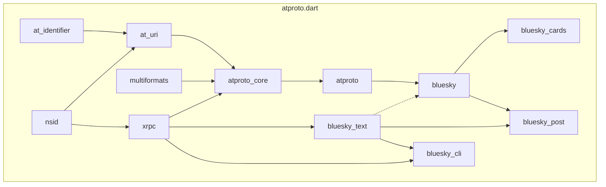

# Overview

## Packages

See the **[Install Package](../getting_started/install_package.md)** section for instructions on how to install a package in your [Dart](https://dart.dev) and [Flutter](https://flutter.dev) app.

### Dart/Flutter

All packages in this matrix can be used in the **[Dart](https://dart.dev)** and **[Flutter](https://flutter.dev)** apps.

| Name                                                                                                  |                                                                   pub.dev                                                                    | Description                                                                                                                                                   |
| ----------------------------------------------------------------------------------------------------- | :------------------------------------------------------------------------------------------------------------------------------------------: | ------------------------------------------------------------------------------------------------------------------------------------------------------------- |
| **[at_identifier](https://github.com/myConsciousness/atproto.dart/tree/main/packages/at_identifier)** |  | Provide standard validation for identifier supported by AT Protocol to Dart/Flutter.                                                                          |
| **[nsid](https://github.com/myConsciousness/atproto.dart/tree/main/packages/nsid)**                   |                    | Provide standard NSID object supported by AT Protocol to Dart/Flutter.                                                                                        |
| **[at_uri](https://github.com/myConsciousness/atproto.dart/tree/main/packages/at_uri)**               |                | Provide standard uri supported by AT Protocol to Dart/Flutter.                                                                                                |
| **[xrpc](https://github.com/myConsciousness/atproto.dart/tree/main/packages/xrpc)**                   |                    | Provide an HTTP client specialized for XRPC communication in AT Protocol.                                                                                     |
| **[multiformats](https://github.com/myConsciousness/atproto.dart/tree/main/packages/multiformats)**   |    | Provide useful interfaces such a [CID](https://docs.ipfs.tech/concepts/content-addressing/) used by AT Protocol to Dart/Flutter.                              |
| **[atproto_core](https://github.com/myConsciousness/atproto.dart/tree/main/packages/atproto_core)**   |    | Provide core reusable and useful functionality for wrapping AT Protocol and related services.                                                                 |
| **[atproto](https://github.com/myConsciousness/atproto.dart/tree/main/packages/atproto)**             |              | Provide the easiest and powerful way to use [com.atproto](https://github.com/bluesky-social/atproto/tree/main/lexicons/com/atproto) lexicons in Dart/Flutter. |
| **[bluesky](https://github.com/myConsciousness/atproto.dart/tree/main/packages/bluesky)**             |              | Provide the easiest and powerful way to use [app.bsky](https://github.com/bluesky-social/atproto/tree/main/lexicons/app/bsky) lexicons in Dart/Flutter.       |
| **[bluesky_text](https://github.com/myConsciousness/atproto.dart/tree/main/packages/bluesky_text)**   |    | Provides the easiest and most powerful way to analyze the text on Bluesky Social.                                                                             |

### Flutter Only

All packages in this matrix can be used only in **[Flutter](https://flutter.dev)** apps.

| Name                                                                                                  |                                                                   pub.dev                                                                    | Description                                                                          |
| ----------------------------------------------------------------------------------------------------- | :------------------------------------------------------------------------------------------------------------------------------------------: | ------------------------------------------------------------------------------------ |
| **[bluesky_cards](https://github.com/myConsciousness/atproto.dart/tree/main/packages/bluesky_cards)** |  | Provide a widget to output Bluesky Social's post content beautifully in Flutter app. |

## Tools

### CLI

| Name                                                                                              |                                                                 pub.dev                                                                  | Description                                                         |
| ------------------------------------------------------------------------------------------------- | :--------------------------------------------------------------------------------------------------------------------------------------: | ------------------------------------------------------------------- |
| **[bluesky_cli](https://github.com/myConsciousness/atproto.dart/tree/main/packages/bluesky_cli)** |  | CLI tool to easily use Bluesky Social's APIs from the command line. |

### GitHub Actions

| Name                                                                                                |                                                                                        Marketplace                                                                                        | Description                                                                    |
| --------------------------------------------------------------------------------------------------- | :---------------------------------------------------------------------------------------------------------------------------------------------------------------------------------------: | ------------------------------------------------------------------------------ |
| **[bluesky_post](https://github.com/myConsciousness/atproto.dart/tree/main/packages/bluesky_post)** |  | Use this action to send a post to Bluesky Social from GitHub actions workflow. |

## Dependency Graph

The packages developed in **[atproto.dart](https://github.com/myConsciousness/atproto.dart)** are very well divided according to the responsibilities they are responsible for, and each package can work universally on its own. In other words, the packages developed in **[atproto.dart](https://github.com/myConsciousness/atproto.dart)**  have a layer-by-layer hierarchy.

The following graph shows the dependencies of the packages developed in **[atproto.dart](https://github.com/myConsciousness/atproto.dart)** in a top-down format.

The solid black lines are relationships that are set in the **dependency section in `pubspec.yaml`**, and the dashed black lines are **compatible package relationships** that are not directly set as dependencies.

