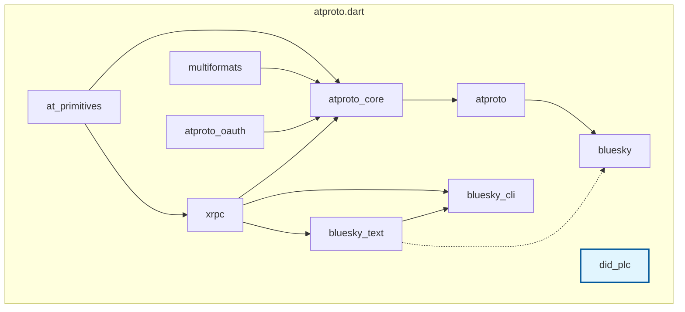

# Overview

## Package Selection

Choose the right package for your project needs. Most developers will use one of the main packages below, while utility packages are automatically included as dependencies.

:::info **Quick Selection Guide**
**For most developers:**

- **[bluesky](./bluesky.md)** - Building Bluesky applications with social features, chat, and feeds
- **[atproto](./atproto.md)** - Core AT Protocol functionality for any AT Protocol service
- **[bluesky_text](./bluesky_text.md)** - Rich text processing and facet generation for Bluesky content

**Utility packages are included automatically as dependencies.**
:::

See the **[Install Package](../getting_started/install_package.md)** section for installation instructions.

### Main Packages

| Package | pub.dev | Description |
| ------- | ------- | ----------- |
| **[bluesky](./bluesky.md)** |  | Complete Bluesky development toolkit with social features, chat, and all AT Protocol functionality. **[→ Documentation](./bluesky.md)** |
| **[atproto](./atproto.md)** |  | Core AT Protocol functionality for any AT Protocol service. Ideal for infrastructure tools and multi-service applications. **[→ Documentation](./atproto.md)** |
| **[bluesky_text](./bluesky_text.md)** |  | Rich text processing and facet generation for Bluesky content. Essential for advanced text features. **[→ Documentation](./bluesky_text.md)** |

### Utility Packages

These packages are automatically included as dependencies and typically don't need direct installation:

| Package | pub.dev | Description |
| ------- | ------- | ----------- |
| **[at_primitives](https://github.com/myConsciousness/atproto.dart/tree/main/packages/at_primitives)** |  | AT Protocol primitive types (identifiers, URIs, NSIDs) - replaces at_identifier, at_uri, and nsid |
| **[xrpc](https://github.com/myConsciousness/atproto.dart/tree/main/packages/xrpc)** |  | HTTP client specialized for XRPC communication in AT Protocol |
| **[multiformats](https://github.com/myConsciousness/atproto.dart/tree/main/packages/multiformats)** |  | Content addressing and [CID](https://docs.ipfs.tech/concepts/content-addressing/) support for AT Protocol |
| **[atproto_core](https://github.com/myConsciousness/atproto.dart/tree/main/packages/atproto_core)** |  | Core functionality and utilities for AT Protocol services |
| **[did_plc](./did_plc.md)** |  | Independent DID PLC Directory client with high-performance caching and streaming. **[→ Documentation](./did_plc.md)** |
| **[atproto_oauth](https://github.com/myConsciousness/atproto.dart/tree/main/packages/atproto_oauth)** |  | OAuth 2.0 with DPoP authentication for AT Protocol services |

## Tools

### CLI

| Name                                                                                              |                                                                 pub.dev                                                                  | Description                                                         |
| ------------------------------------------------------------------------------------------------- | :--------------------------------------------------------------------------------------------------------------------------------------: | ------------------------------------------------------------------- |
| **[bluesky_cli](https://github.com/myConsciousness/atproto.dart/tree/main/packages/bluesky_cli)** |  | CLI tool to easily use Bluesky Social's APIs from the command line. |

### GitHub Actions

| Name                                                                 |                                                                                        Marketplace                                                                                        | Description                                                                    |
| -------------------------------------------------------------------- | :---------------------------------------------------------------------------------------------------------------------------------------------------------------------------------------: | ------------------------------------------------------------------------------ |
| **[bluesky-post](https://github.com/myConsciousness/bluesky-post/)** |  | Use this action to send a post to Bluesky Social from GitHub actions workflow. |

## Package Architecture

atproto.dart uses a layered architecture where each package has clear responsibilities and can work independently. This modular design allows you to use only what you need while maintaining compatibility across the ecosystem.

The dependency graph below shows how packages relate to each other. Solid lines represent direct dependencies in `pubspec.yaml`, while dashed lines show compatible package relationships.

