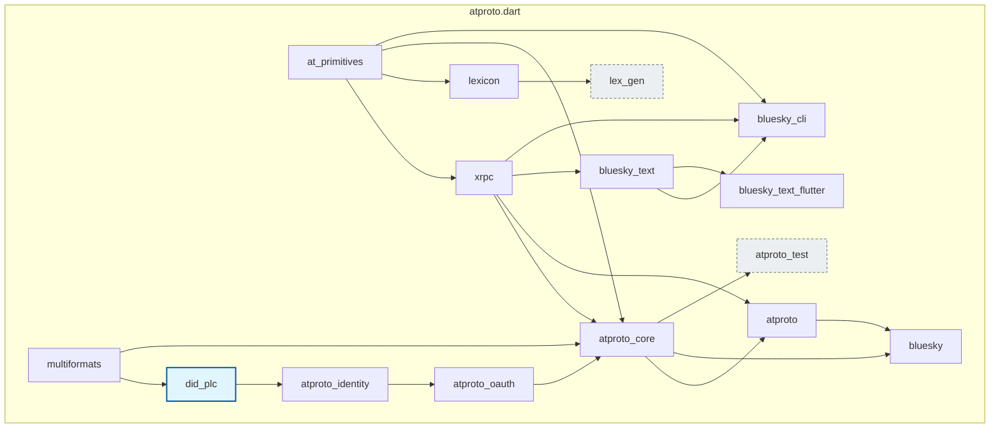

# Overview

This page is the single source of truth for **which package to use**. The
[Install Packages](../getting_started/install_package.md) page covers *how* to add them.

## Quick Selection Guide

:::info **Start here**

- Building a **Bluesky** app → **[bluesky](./bluesky.md)**
- Building on **AT Protocol** generally (any service, not just Bluesky) → **[atproto](./atproto.md)**
- Signing in with **OAuth** → **[atproto_oauth](./atproto_oauth.md)**
- Just want to **try it from a terminal** → **[bluesky_cli](./bluesky_cli.md)**

Everything else is either an add-on you install deliberately, or a dependency you
never touch directly.
:::

## Packages you install directly

You name these in your own `pubspec.yaml`. Some also appear deeper in the graph as
dependencies of each other — declare one whenever you import it directly.

| Package | pub.dev | Use it when |
| ------- | ------- | ----------- |
| **[bluesky](./bluesky.md)** |  | You are building a Bluesky client: posts, feeds, chat, moderation. Includes all of `atproto`. **[→ Documentation](./bluesky.md)** |
| **[atproto](./atproto.md)** |  | You target AT Protocol itself — repos, records, sync, identity — for a non-Bluesky service or infrastructure tool. **[→ Documentation](./atproto.md)** |
| **[atproto_oauth](./atproto_oauth.md)** |  | You need real user sign-in. Pluggable OAuth 2.0 with DPoP. This is the recommended auth entrypoint. **[→ Documentation](./atproto_oauth.md)** |
| **[atproto_identity](./atproto_identity.md)** |  | You resolve handles/DIDs yourself, or verify inbound service-auth JWTs (feed generators, labelers). **[→ Documentation](./atproto_identity.md)** |
| **[bluesky_text](./bluesky_text.md)** |  | You need facet detection (mentions, links, hashtags) and grapheme-accurate length limits. **[→ Documentation](./bluesky_text.md)** |
| **[bluesky_text_flutter](./bluesky_text_flutter.md)** |  | You want ready-made Flutter widgets: a highlighting rich-text controller and a post viewer. Nothing depends on this — add it yourself. **[→ Documentation](./bluesky_text_flutter.md)** |
| **[did_plc](./did_plc.md)** |  | You talk to the DID PLC Directory directly — caching, streaming, batch resolution. Usable completely standalone. **[→ Documentation](./did_plc.md)** |
| **[at_primitives](./at_primitives.md)** |  | You name `AtUri`, `NSID`, or the handle/DID/TID validators in your own code. The clients depend on it but do not re-export it, so declare it yourself. **[→ Documentation](./at_primitives.md)** |
| **[lexicon](https://github.com/myConsciousness/atproto.dart/tree/main/packages/lexicon)** |  | Niche: you parse and validate Lexicon schema documents yourself. Standalone; no client packages depend on it. |

## Command line

| Package | pub.dev | Description |
| ------- | ------- | ----------- |
| **[bluesky_cli](./bluesky_cli.md)** |  | Call Bluesky APIs from your terminal via the `bsky` executable. Install with `dart pub global activate bluesky_cli` — not a library dependency. **[→ Documentation](./bluesky_cli.md)** |

## Transitive packages

You get these automatically. You normally do **not** add them to `pubspec.yaml`.

| Package | pub.dev | Notes |
| ------- | ------- | ----- |
| **[atproto_core](https://github.com/myConsciousness/atproto.dart/tree/main/packages/atproto_core)** |  | Shared client plumbing: sessions, retries, pagination, service definitions. Its own README says to use it through `atproto`/`bluesky`. |
| **[xrpc](https://github.com/myConsciousness/atproto.dart/tree/main/packages/xrpc)** |  | XRPC HTTP client. Mostly transitive, but its `XRPCResponse` and `XRPCError` types surface in the public API of `atproto`/`bluesky`, so you will see them in your code. |
| **[multiformats](https://github.com/myConsciousness/atproto.dart/tree/main/packages/multiformats)** |  | [CID](https://docs.ipfs.tech/concepts/content-addressing/) and content-addressing support. Purely transitive. |

## Internal packages

Part of this repository's build and test tooling. Not intended for application use.

| Package | Published | Notes |
| ------- | --------- | ----- |
| **[lex_gen](https://github.com/myConsciousness/atproto.dart/tree/main/packages/lex_gen)** | [Yes](https://pub.dev/packages/lex_gen) | The code generator that turns Lexicon schemas into the Dart sources in this repo. It is a library with no `bin/` entrypoint, driven by repo scripts. |
| **[atproto_test](https://github.com/myConsciousness/atproto.dart/tree/main/packages/atproto_test)** | **No** (`publish_to: none`) | Shared test harness used by this repo's own packages. Not available on pub.dev. |

## GitHub Actions

| Name | Marketplace | Description |
| ---- | :---------: | ----------- |
| **[bluesky-post](https://github.com/myConsciousness/bluesky-post/)** |  | Send a post to Bluesky Social from a GitHub Actions workflow. |

## Package Architecture

atproto.dart is layered: each package owns one concern, and higher-level packages
compose lower-level ones. You can adopt a single layer without pulling in the rest.

The graph below is derived from the `dependencies` blocks of every
`packages/*/pubspec.yaml` — runtime edges only. Arrows point from a package to the
packages that depend on it. Grey nodes are internal tooling. `dev_dependencies`
are omitted: several packages depend on each other at test time only, which does
not affect what ships in your app.

```mermaid
flowchart TD
    subgraph atproto.dart
    at_primitives --> xrpc;
    at_primitives --> lexicon;
    at_primitives --> atproto_core;
    at_primitives --> bluesky_cli;

    lexicon --> lex_gen;

    multiformats --> did_plc;
    multiformats --> atproto_core;

    did_plc --> atproto_identity;
    atproto_identity --> atproto_oauth;
    atproto_oauth --> atproto_core;

    xrpc --> atproto_core;
    xrpc --> atproto;
    xrpc --> bluesky_text;
    xrpc --> bluesky_cli;

    atproto_core --> atproto;
    atproto_core --> bluesky;
    atproto --> bluesky;

    bluesky_text --> bluesky_cli;
    bluesky_text --> bluesky_text_flutter;

    atproto_core --> atproto_test;

    style did_plc fill:#e1f5fe,stroke:#01579b,stroke-width:2px
    style lex_gen fill:#eceff1,stroke:#546e7a,stroke-dasharray: 4 3
    style atproto_test fill:#eceff1,stroke:#546e7a,stroke-dasharray: 4 3
    end
```

Note that `atproto_oauth` is **not** an isolated branch: it feeds into
`atproto_core`, so `did_plc → atproto_identity → atproto_oauth → atproto_core →
atproto → bluesky` is one continuous chain. Adding `bluesky` transitively gives you
identity resolution and OAuth support.
