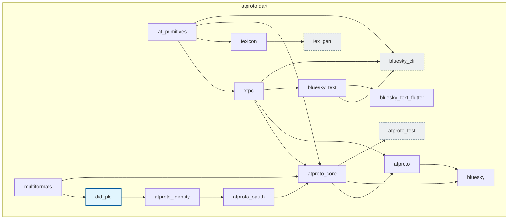

# Overview

atproto.dart ships two kinds of product, and the difference decides where a thing
belongs in your project:

- A **[Package](./packages/bluesky.md)** is a Dart library. You name it in your
  `pubspec.yaml` and import it. Fifteen of these exist, though you interact with
  only a handful directly.
- A **[Tool](./tools/bluesky_cli.md)** is something you run. A terminal
  executable, a GitHub Action, a code generator, a template you clone. You never
  add one to your dependencies.

This page is the single source of truth for **which product to use**. The
[Install Packages](../getting_started/install_package.md) page covers *how* to add them.

:::info **Start here**

- Building a **Bluesky** app → **[bluesky](./packages/bluesky.md)**
- Building on **AT Protocol** generally (any service, not just Bluesky) → **[atproto](./packages/atproto.md)**
- Signing in with **OAuth** → **[atproto_oauth](./packages/atproto_oauth.md)**
- Just **trying the APIs** from a terminal → **[bluesky_cli](./tools/bluesky_cli.md)**
- Building a **custom feed** → **[Feed Generator template](./tools/feed_generator.md)**
- Posting from **CI** → **[bluesky-post action](./tools/bluesky_post.md)**
:::

## Packages

### Packages you install directly

You name these in your own `pubspec.yaml`. Some also appear deeper in the graph as
dependencies of each other — declare one whenever you import it directly.

| Package | pub.dev | Use it when |
| ------- | ------- | ----------- |
| **[bluesky](./packages/bluesky.md)** |  | You are building a Bluesky client: posts, feeds, chat, moderation. Includes all of `atproto`. |
| **[atproto](./packages/atproto.md)** |  | You target AT Protocol itself — repos, records, sync, identity — for a non-Bluesky service or infrastructure tool. |
| **[atproto_oauth](./packages/atproto_oauth.md)** |  | You need real user sign-in. Pluggable OAuth 2.0 with DPoP. This is the recommended auth entrypoint. |
| **[atproto_identity](./packages/atproto_identity.md)** |  | You resolve handles/DIDs yourself, or verify inbound service-auth JWTs (feed generators, labelers). |
| **[bluesky_text](./packages/bluesky_text.md)** |  | You need facet detection (mentions, links, hashtags) and grapheme-accurate length limits. |
| **[bluesky_text_flutter](./packages/bluesky_text_flutter.md)** |  | You want ready-made Flutter widgets: a highlighting rich-text controller and a post viewer. Nothing depends on this — add it yourself. |
| **[did_plc](./packages/did_plc.md)** |  | You talk to the DID PLC Directory directly — caching, streaming, batch resolution. Usable completely standalone. |
| **[at_primitives](./packages/at_primitives.md)** |  | You name `AtUri`, `NSID`, or the handle/DID/TID validators in your own code. The clients depend on it but do not re-export it, so declare it yourself. |
| **[lexicon](./packages/lexicon.md)** |  | You parse and validate Lexicon schema documents yourself, for your own tooling. Standalone; no client package depends on it at runtime. |

### Packages you get automatically

These arrive as transitive dependencies. You normally do **not** add them to
`pubspec.yaml` — but their types appear in your code, which is why they are
documented.

| Package | pub.dev | Notes |
| ------- | ------- | ----- |
| **[atproto_core](./packages/atproto_core.md)** |  | Shared client plumbing: `ServiceContext`, sessions and refresh, the retry system, exceptions. Use it through `atproto`/`bluesky`. |
| **[xrpc](./packages/xrpc.md)** |  | The XRPC HTTP layer. Every response you handle is an `XRPCResponse`, so you will read this type even though you rarely import the package. |
| **[multiformats](./packages/multiformats.md)** |  | [CID](https://docs.ipfs.tech/concepts/content-addressing/) parsing and content addressing. Upstream hands you CIDs as strings; this turns them into values. |

## Tools

Things you run rather than depend on.

| Tool | Kind | Use it for |
| ---- | ---- | ---------- |
| **[bluesky_cli](./tools/bluesky_cli.md)** | Terminal executable | Calling any Bluesky or AT Protocol endpoint from a shell. Install with `dart pub global activate bluesky_cli`. |
| **[Feed Generator](./tools/feed_generator.md)** | Clone-and-edit template | Building a Bluesky custom feed: a service that ranks posts and serves the skeleton the AppView asks for. |
| **[bluesky-post](./tools/bluesky_post.md)** | GitHub Action | Posting to Bluesky from a workflow — release announcements, CI notifications, scheduled posts. |
| **[lex_gen](./tools/lex_gen.md)** | Code generator | Regenerating this repo's Dart sources from Lexicon schemas. Effectively internal to the monorepo. |
| **[atproto_test](./tools/atproto_test.md)** | Test harness | Contributing to this repo. Not published to pub.dev, so it is unavailable to your project. |

## Architecture

atproto.dart is layered: each package owns one concern, and higher-level packages
compose lower-level ones. You can adopt a single layer without pulling in the rest.

The graph below is derived from the `dependencies` blocks of every
`packages/*/pubspec.yaml` — runtime edges only. Arrows point from a package to the
packages that depend on it. Grey nodes are tooling rather than libraries.
`dev_dependencies` are omitted: several packages depend on each other at test time
only, which does not affect what ships in your app.

Note that `atproto_oauth` is **not** an isolated branch: it feeds into
`atproto_core`, so `did_plc → atproto_identity → atproto_oauth → atproto_core →
atproto → bluesky` is one continuous chain. Adding `bluesky` transitively gives you
identity resolution and OAuth support.

The **[Feed Generator](./tools/feed_generator.md)** template and the
**[bluesky-post](./tools/bluesky_post.md)** action sit outside this graph: the
first lives under `templates/` in this repository, the second in a repository of
its own. Both are built on the packages above.
